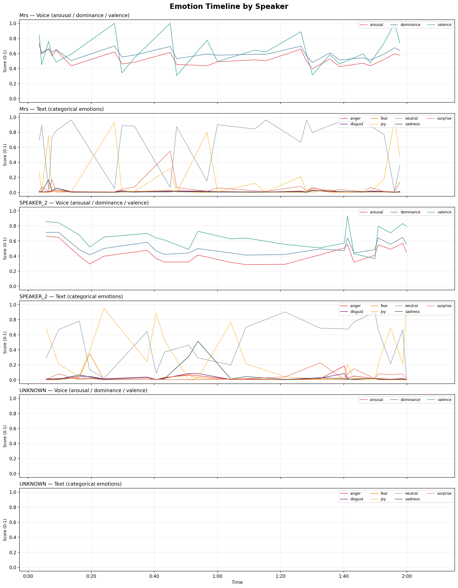

# WhisperX Audio Transcription and Speaker Diarization

A modular Python toolkit for extracting, transcribing, and speaker-diarizing audio from video and audio files. Built on WhisperX (large-v2) and pyannote.audio 4.x, optimised for NVIDIA GPUs with sequential model loading to keep VRAM under 16 GB.

---

## Table of Contents

1. [Features](#features)
2. [Project Structure](#project-structure)
3. [Architecture and Data Flow](#architecture-and-data-flow)
4. [Requirements](#requirements)
5. [Installation](#installation)
6. [Configuration](#configuration)
7. [Usage](#usage)
8. [CLI Reference](#cli-reference)
9. [Module Reference](#module-reference)
10. [Experimental: Speaker Name Detection](#experimental-speaker-name-detection)
11. [Experimental: Emotion Analysis](#experimental-emotion-analysis)
12. [Sample Output](#sample-output)
13. [Output Formats](#output-formats)
14. [Performance](#performance)
15. [Troubleshooting](#troubleshooting)
16. [Security](#security)
17. [License and Attribution](#license-and-attribution)

---

## Features

- Audio extraction from video files (MP4, MOV, AVI, MKV, FLV) and audio files (WAV, MP3, M4A, AAC, FLAC, OGG).
- High-accuracy speech-to-text using WhisperX large-v2 (float16).
- Word-level timestamp alignment.
- Speaker diarization with pyannote.audio 3.0 pipeline.
- Sequential model loading: each model is loaded, used, deleted, and VRAM is cleared before the next model loads.
- Dynamic VRAM-aware batch sizing: automatically probes free GPU memory after model load and uses the largest safe batch size (`--batch_size 0`, the default).
- VRAM telemetry: logs used/free/total VRAM at every pipeline stage for full visibility.
- Simple mode (`--simple`): transcript split by natural speech pauses, no diarization.
- Batch processing: point at a folder to process every media file inside it.
- Experimental name detection (`--experimental`): scans the transcript for self-introductions (e.g. "I'm Benj", "my name is Sarah") and replaces generic `SPEAKER_N` labels with detected names.
- Experimental emotion analysis (`--emotions`): dual-model speech emotion recognition -- analyses vocal tone (arousal / valence / dominance) and text content (7 categorical emotions) per segment, with per-speaker aggregation. Ideal for HCD interview analysis.
- Backward-compatible: `python transcribe_and_diarize.py` still works (thin wrapper around `main.py`).

---

## Project Structure

```
Diarization/
├── main.py                      # CLI entry point (argparse, dispatches to pipeline)
├── transcribe_and_diarize.py    # Legacy wrapper (imports and calls main.py)
├── diarize/                     # Core package
│   ├── __init__.py              # Package exports
│   ├── utils.py                 # VRAM management, device detection, logging
│   ├── audio.py                 # FFmpeg audio extraction
│   ├── transcribe.py            # WhisperX transcription + alignment
│   ├── diarization.py           # pyannote speaker diarization
│   ├── speakers.py              # Speaker label assignment + name detection
│   ├── emotions.py              # Speech emotion recognition (audio + text)
│   ├── visualize.py             # Emotion timeline graphs (matplotlib PNG)
│   ├── export.py                # Text file export (diarized / simple / emotions)
│   └── pipeline.py              # Orchestrates single-file and folder workflows
├── sample_interview.mp4         # CC-BY sample video for demo / testing
├── sample_output/               # Pre-generated example outputs (committed)
│   ├── sample_interview.txt             # Diarized transcript
│   ├── sample_interview_emotions.txt    # Emotion-annotated transcript
│   └── sample_interview_emotions.png    # Emotion timeline graph
├── requirements.txt             # Python dependencies with install instructions
├── .env                         # Hugging Face token (not committed)
├── .env.example                 # Template for .env
├── .gitignore                   # Standard Python + project-specific ignores
├── outputs/                     # Default output directory (created on demand)
└── whisper_env/                 # Python virtual environment
```

---

## Architecture and Data Flow

Each media file passes through the pipeline stages below. Models are loaded **one at a time** and deleted immediately after use to stay within 16 GB VRAM.

```
Input media file (video or audio)
       │
       ▼
┌──────────────────┐
│  1. extract_audio │  FFmpeg → 16 kHz mono WAV          VRAM: 0 GB
│     (audio.py)    │
└────────┬─────────┘
         ▼
┌──────────────────┐
│  2. transcribe    │  WhisperX large-v2 → segments       VRAM: ~10-12 GB
│  (transcribe.py)  │  auto batch size from free VRAM
└────────┬─────────┘
         ▼  (model deleted, VRAM cleared)
┌──────────────────┐
│  3. align         │  WhisperX alignment model →          VRAM: ~3-4 GB
│  (transcribe.py)  │  refined word timestamps
└────────┬─────────┘
         ▼  (model deleted, VRAM cleared)
┌──────────────────┐
│  4. diarize       │  pyannote 3.0 pipeline →             VRAM: ~6-8 GB
│  (diarization.py) │  speaker annotation (who spoke when)
└────────┬─────────┘  [SKIPPED in --simple mode]
         ▼  (pipeline deleted, VRAM cleared)
┌──────────────────┐
│  5. assign        │  Map speaker labels onto words       VRAM: ~0 GB
│  (speakers.py)    │  by midpoint timestamp overlap
└────────┬─────────┘
         ▼
┌──────────────────┐  [ONLY with --experimental]
│  6. detect names  │  Regex scan for "I'm X" patterns    VRAM: ~0 GB
│  (speakers.py)    │  Replace SPEAKER_N → detected name
└────────┬─────────┘
         ▼
┌──────────────────┐  [ONLY with --emotions]
│  7. emotions      │  Audio emotion model →               VRAM: ~1 GB
│  (emotions.py)    │  arousal / dominance / valence
│                   │  Text emotion model →                VRAM: ~0.5 GB
│                   │  anger/disgust/fear/joy/neutral/
│                   │  sadness/surprise
└────────┬─────────┘  (models deleted, VRAM cleared)
         ▼
┌──────────────────┐
│  8. export        │  Write .txt file                     VRAM: ~0 GB
│  (export.py)      │  (+ *_emotions.txt when --emotions)
│                   │  (+ *_emotions.png emotion graph)
└────────┬─────────┘
         ▼
Output .txt file
```

### Data Structures

The core data flowing between stages is a **WhisperX result dict**:

```python
{
    "language": "en",
    "segments": [
        {
            "start": 0.0,
            "end": 3.5,
            "text": "Hello guys I'm Benj",
            "words": [
                {"word": "Hello", "start": 0.0, "end": 0.3, "speaker": "SPEAKER_1"},
                {"word": "guys",  "start": 0.35, "end": 0.6, "speaker": "SPEAKER_1"},
                {"word": "I'm",   "start": 0.65, "end": 0.8, "speaker": "SPEAKER_1"},
                {"word": "Benj",  "start": 0.85, "end": 1.1, "speaker": "SPEAKER_1"},
            ]
        },
        ...
    ]
}
```

The `"speaker"` key is added by `assign_speakers_to_words()` in stage 5. In `--experimental` mode, these labels may be replaced with real names (e.g. `"Benj"` instead of `"SPEAKER_1"`).

### pyannote 4.x Compatibility

pyannote.audio 4.x's `Pipeline()` returns a `DiarizeOutput` **dataclass**, not a raw `Annotation` object. The actual annotation is in the `.speaker_diarization` attribute. The `diarization.py` module handles this transparently:

```python
diarize_output = pipeline(audio_dict)
if hasattr(diarize_output, 'speaker_diarization'):
    diarization = diarize_output.speaker_diarization  # pyannote 4.x
else:
    diarization = diarize_output                       # pyannote 3.x
```

### Audio Loading Workaround

pyannote 4.x defaults to `torchcodec` for audio decoding, which is incompatible with PyTorch 2.5.1. The `diarization.py` module bypasses this by loading audio via `torchaudio` and passing a dict `{"waveform": tensor, "sample_rate": int}` to the pipeline.

---

## Requirements

### Hardware

- NVIDIA GPU with 16 GB+ VRAM (CUDA 12.1 compatible)
- 16 GB+ system RAM
- 10 GB+ free disk space (models are cached by Hugging Face)

### Software

| Dependency          | Version          | Purpose                        |
|---------------------|------------------|--------------------------------|
| Python              | 3.9+             | Runtime                        |
| CUDA                | 12.1             | GPU acceleration               |
| FFmpeg              | any              | Audio extraction               |
| PyTorch             | 2.5.1+cu121      | Deep learning backend          |
| torchaudio          | 2.5.1            | Audio loading for pyannote     |
| WhisperX            | latest (GitHub)  | Transcription + alignment      |
| pyannote.audio      | 4.0+             | Speaker diarization            |
| python-dotenv       | any              | .env file loading              |

Native Linux provides optimal performance. WSL2 is recommended for Windows users.

---

## Installation

### 1. System Dependencies

**Linux / WSL2 (Ubuntu/Debian):**
```bash
sudo apt update && sudo apt install -y ffmpeg git python3-venv python3-pip
```

**Windows:**
Install [FFmpeg](https://ffmpeg.org/download.html), [Git](https://git-scm.com/download/win), and [Python 3.9+](https://www.python.org/downloads/).

### 2. Virtual Environment

```bash
python3 -m venv whisper_env

# Linux / WSL2
source whisper_env/bin/activate

# Windows PowerShell
.\whisper_env\Scripts\Activate.ps1
```

### 3. Python Packages

```bash
pip install --upgrade pip setuptools wheel

# PyTorch with CUDA 12.1 (install first)
pip install torch==2.5.1 torchaudio==2.5.1 torchvision==0.20.1 \
    --index-url https://download.pytorch.org/whl/cu121

# Remaining dependencies
pip install -r requirements.txt
```

You may see PyTorch version warnings during installation. These are safe to ignore -- all components work correctly with PyTorch 2.5.1.

---

## Configuration

### Hugging Face Token

Speaker diarization requires a Hugging Face token with access to **gated models**. Get a token from [huggingface.co/settings/tokens](https://huggingface.co/settings/tokens), then **accept access** on each of these model pages:

| Model | Link | Required For |
|-------|------|-------------|
| pyannote/speaker-diarization-3.0 | [Accept access](https://huggingface.co/pyannote/speaker-diarization-3.0) | Diarization pipeline |
| pyannote/segmentation-3.0 | [Accept access](https://huggingface.co/pyannote/segmentation-3.0) | Speaker segmentation |

Without accepting access, diarization will fail and the script will fall back to labelling all text as `SPEAKER_1`.

### Emotion Models (no extra permissions needed)

The `--emotions` feature uses two additional models that are **not gated** -- they download automatically on first run with no HuggingFace access approvals:

| Model | License | Purpose |
|-------|---------|--------|
| [audeering/wav2vec2-large-robust-12-ft-emotion-msp-dim](https://huggingface.co/audeering/wav2vec2-large-robust-12-ft-emotion-msp-dim) | CC-BY-NC-SA-4.0 | Vocal tone → arousal / dominance / valence |
| [j-hartmann/emotion-english-distilroberta-base](https://huggingface.co/j-hartmann/emotion-english-distilroberta-base) | Open | Text content → 7 categorical emotions |

> **Note:** The audeering model is licensed CC-BY-NC-SA-4.0 (non-commercial). This is fine for educational and research use.

### Token Setup (pick one)

**Option A -- .env file (recommended):**
```bash
cp .env.example .env
# Edit .env and set: HF_TOKEN=hf_your_token_here
```

**Option B -- environment variable:**
```bash
export HF_TOKEN="hf_your_token_here"
```

**Option C -- command line:**
```bash
python main.py video.mov --hf_token hf_your_token_here
```

Priority: `--hf_token` flag > `HF_TOKEN` environment variable > `.env` file.

---

## Usage

### Basic Transcription + Diarization

```bash
python main.py video.mov
```

Output: `video.txt` in the same directory.

### Simple Mode (No Diarization)

Faster processing. Produces a transcript split by natural speech pauses with no speaker labels.

```bash
python main.py video.mov --simple
```

### Experimental Name Detection

Scans the transcript for self-introductions and replaces `SPEAKER_N` labels with real names. Requires diarization (not compatible with `--simple`).

```bash
python main.py video.mov --experimental
```

### Emotion Analysis

Run dual-model emotion scoring on every transcript segment. Produces a separate `*_emotions.txt` file with per-segment and per-speaker emotion profiles.

```bash
# Emotion analysis (works with or without diarization)
python main.py interview.wav --emotions

# Combine with name detection for the full experience
python main.py interview.wav --experimental --emotions

# Even works in simple mode (no speaker labels, but emotions are still scored)
python main.py interview.wav --simple --emotions
```

### Batch Processing (Folder)

Process every media file in a directory:

```bash
python main.py /path/to/media/folder --output_dir outputs
python main.py /path/to/media/folder --output_dir outputs --simple
python main.py /path/to/media/folder --output_dir outputs --experimental
```

### Custom Output Paths

```bash
# Specific output file
python main.py video.mov --output transcript.txt

# Output directory
python main.py video.mov --output_dir ./my_transcripts
```

### Performance Tuning

By default, the batch size is calculated automatically from free VRAM after the model loads. You can override it:

```bash
# Auto batch size (default -- uses all available VRAM)
python main.py video.mov

# Force a specific batch size (e.g. for benchmarking or low-VRAM GPUs)
python main.py video.mov --batch_size 32

# Low VRAM fallback
python main.py video.mov --batch_size 8
```

### Legacy Entry Point

The old command still works:

```bash
python transcribe_and_diarize.py video.mov --experimental
```

---

## CLI Reference

```
usage: main.py [-h] [--hf_token TOKEN] [--batch_size N] [--output FILE]
               [--output_dir DIR] [--simple] [--experimental] [--emotions]
               media_file

positional arguments:
  media_file            Path to a video/audio file, or a folder of media files.

options:
  -h, --help            Show help and exit.
  --hf_token TOKEN      Hugging Face API token. Falls back to HF_TOKEN env var
                        or .env file.
  --batch_size N        WhisperX transcription batch size.
                        0 = auto (probe free VRAM after model load and use as
                        much as possible). Any positive value is used as-is.
                        Default: 0 (auto).
  --output FILE         Output text file path (single file only).
                        Default: <input_name>.txt alongside the input.
  --output_dir DIR      Output directory. Created if it does not exist.
                        Default: same directory as the input file.
  --simple              Simple mode: transcript split by pauses, no speaker
                        diarization. Faster processing.
  --experimental        Experimental: detect speaker names from self-introductions
                        ("I'm John", "my name is Sarah") and replace SPEAKER_N
                        labels with detected names.
  --emotions            Experimental: run dual-model speech emotion analysis on
                        every segment. Outputs arousal/valence/dominance (vocal
                        tone) and 7 categorical emotions (text content) in a
                        separate *_emotions.txt file and *_emotions.png graph.
                        Ideal for HCD interviews.
```

### Exit Codes

| Code | Meaning |
|------|---------|
| 0    | Success |
| 1    | Input not found, FFmpeg missing, or unrecoverable error |

---

## Module Reference

All modules live in the `diarize/` package and can be imported independently.

### diarize/utils.py

| Function | Signature | Description |
|----------|-----------|-------------|
| `setup_logging` | `(level=logging.INFO)` | Configure root logger with timestamp format. |
| `clear_vram` | `()` | Run `gc.collect()` + `torch.cuda.empty_cache()`. |
| `get_device` | `() -> str` | Return `"cuda"` or `"cpu"`. Logs GPU info. |
| `get_total_vram` | `() -> float` | Return total GPU VRAM in GB (0.0 on CPU). |
| `get_free_vram` | `() -> float` | Return current free GPU VRAM in GB after cache flush. |
| `log_vram_usage` | `(label="")` | Log one-line snapshot: used / free / total GB. |
| `optimal_batch_size` | `(per_item_mb=320, safety_mb=1200) -> int` | Calculate largest safe batch size from current free VRAM. Clamped to [4, 128]. |

### diarize/audio.py

| Function | Signature | Description |
|----------|-----------|-------------|
| `extract_audio` | `(media_file, output_audio_path, sr=16000) -> str` | Extract mono PCM WAV via FFmpeg. Returns output path. Exits on failure. |

### diarize/transcribe.py

| Function | Signature | Description |
|----------|-----------|-------------|
| `transcribe_audio` | `(audio_path, device, batch_size=0, compute_type="float16") -> dict` | Load WhisperX large-v2, auto-calculate batch size from free VRAM (if 0), transcribe, delete model, clear VRAM. Returns result dict. |
| `align_timestamps` | `(audio_path, result, device) -> dict` | Load alignment model, refine word timestamps, delete model, clear VRAM. Returns updated result. |

### diarize/diarization.py

| Function | Signature | Description |
|----------|-----------|-------------|
| `diarize_audio` | `(audio_path, hf_token, device) -> Annotation or None` | Load pyannote pipeline, run diarization, handle DiarizeOutput unwrapping. Returns pyannote Annotation or None. |

### diarize/speakers.py

| Function | Signature | Description |
|----------|-----------|-------------|
| `assign_speakers_to_words` | `(result, diarization) -> dict` | Assign `SPEAKER_N` labels to words by midpoint timestamp overlap. |
| `detect_speaker_names` | `(result) -> dict` | Scan transcript for name introduction patterns. Returns `{label: name}` map. |
| `apply_speaker_names` | `(result, name_map) -> dict` | Replace generic labels with detected names in the result dict. |

### diarize/export.py

| Function | Signature | Description |
|----------|-----------|-------------|
| `export_to_txt` | `(result, output_file, simple=False)` | Write `.txt` file. Diarized mode groups by speaker; simple mode splits by pauses. |
| `export_emotions_to_txt` | `(emotion_results, speaker_summary, output_file)` | Write emotion-annotated `.txt` file with per-segment scores and per-speaker profiles. |

### diarize/emotions.py

| Function | Signature | Description |
|----------|-----------|-------------|
| `analyze_emotions` | `(result, audio_path, device) -> list[dict]` | Run dual-model (audio + text) emotion analysis on every segment. Loads/unloads models sequentially. |
| `aggregate_emotions_by_speaker` | `(emotion_results) -> dict` | Average emotion scores per speaker across all their segments. |
| `AUDIO_EMOTION_MODEL` | `str` | HuggingFace model ID for audio emotions: `audeering/wav2vec2-large-robust-12-ft-emotion-msp-dim`. |
| `TEXT_EMOTION_MODEL` | `str` | HuggingFace model ID for text emotions: `j-hartmann/emotion-english-distilroberta-base`. |

### diarize/visualize.py

| Function | Signature | Description |
|----------|-----------|-------------|
| `plot_emotion_timeline` | `(emotion_results, output_path)` | Render per-speaker emotion timeline subplots (voice + text) and save as PNG. |

### diarize/pipeline.py

| Function | Signature | Description |
|----------|-----------|-------------|
| `process_single_file` | `(media_file, output_file, args, device)` | Run the full pipeline on one file. Handles temp file cleanup. |
| `process_folder` | `(folder_path, args, device)` | Batch-process all media files in a directory. |
| `SUPPORTED_FORMATS` | `set` | File extensions recognised during batch processing: `.mp4`, `.mov`, `.avi`, `.mkv`, `.flv`, `.wav`, `.mp3`, `.m4a`, `.aac`, `.flac`, `.ogg`. |

---

## Experimental: Speaker Name Detection

When `--experimental` is passed, the pipeline scans the diarized transcript for self-introduction patterns **after** speaker labels have been assigned. If a speaker says something like "I'm Benj" or "my name is Sarah", the generic `SPEAKER_N` label is replaced with the detected name throughout the entire output.

### Supported Patterns

| Pattern | Example | Detected Name |
|---------|---------|---------------|
| `my name is X` / `my name's X` | "My name is Sarah" | Sarah |
| `I'm X` / `I am X` | "I'm Benj" | Benj |
| `call me X` | "Call me Dave" | Dave |
| `hello/hey/hi, I'm X` | "Hello guys, I'm Toby" | Toby |
| `this is X speaking` | "This is John speaking" | John |
| `the name is X` / `the name's X` | "The name's Bond" | Bond |

### False-Positive Filtering

Common words that follow "I'm" but are not names (e.g. "I'm going", "I'm excited", "I'm really") are filtered out via a built-in blocklist of ~70 words. Only capitalised words that pass the filter are accepted as names.

### Limitations

- Only detects **first names** (single word, 2-20 characters, starts with a capital letter).
- Only the **first** detected name per speaker is used.
- Relies on accurate diarization. If diarization assigns the introduction to the wrong speaker, the name mapping will be wrong.
- Does not detect names mentioned by other speakers (e.g. "This is my friend John" will not be detected for the friend's speaker label).

### Example Output

Without `--experimental`:
```
SPEAKER_1: Hello guys, I'm Benj.
SPEAKER_2: I'm Toby and we're from the parkour team Stora.
SPEAKER_1: And today we are going to be reality checking Assassin's Creed.
```

With `--experimental`:
```
Benj: Hello guys, I'm Benj.
Toby: I'm Toby and we're from the parkour team Stora.
Benj: And today we are going to be reality checking Assassin's Creed.
```

---

## Experimental: Emotion Analysis

When `--emotions` is passed, the pipeline runs **two complementary emotion models** on every transcript segment after diarization (or after alignment in `--simple` mode). Results are written to a separate `*_emotions.txt` file alongside the standard transcript.

This feature is designed for **human-centered design (HCD) interview analysis**, where understanding participant emotions, frustrations, and moments of delight is critical.

### Dual-Model Approach

| Model | Type | What It Captures | Output |
|-------|------|-----------------|--------|
| `audeering/wav2vec2-large-robust-12-ft-emotion-msp-dim` | Audio (vocal tone) | **How** something is said — pitch, rhythm, energy | arousal, dominance, valence (0→1 each) |
| `j-hartmann/emotion-english-distilroberta-base` | Text (word content) | **What** is said — semantic emotion in the words | anger, disgust, fear, joy, neutral, sadness, surprise |

**Why two models?** A participant might say "that's fine" (neutral text) while sounding frustrated (low valence, high arousal). Or they might describe a problem calmly (neutral voice) using strongly negative words. The dual approach catches both signals.

### Audio Emotion Dimensions

| Dimension | Low (→ 0) | High (→ 1) | HCD Insight |
|-----------|-----------|-------------|-------------|
| **Arousal** | Calm, drowsy, bored | Excited, agitated, energised | Spots moments of high engagement or frustration |
| **Dominance** | Submissive, uncertain, helpless | Confident, in-control, assertive | Reveals whether users feel empowered or overwhelmed |
| **Valence** | Negative, unpleasant, distressed | Positive, pleasant, happy | Core sentiment — pain points vs. delight moments |

### Text Emotion Categories

| Emotion | Typical HCD Signal |
|---------|--------------------|
| **anger** 🤬 | Frustration with a feature or process |
| **disgust** 🤢 | Strong aversion to a design choice |
| **fear** 😨 | Anxiety, uncertainty, or feeling lost |
| **joy** 😀 | Delight, satisfaction, a feature that works well |
| **neutral** 😐 | Factual description, no strong feeling |
| **sadness** 😭 | Disappointment, unmet expectations |
| **surprise** 😲 | Unexpected behaviour (positive or negative) |

### Output Format

The `*_emotions.txt` file contains a header, per-segment scores, and per-speaker profiles:

```
================================================================================
EMOTION-ANNOTATED TRANSCRIPT
================================================================================

Models:
  Audio: audeering/wav2vec2-large-robust-12-ft-emotion-msp-dim
    Arousal  (0-1): activation / excitement
    Dominance(0-1): control / confidence
    Valence  (0-1): positivity / pleasantness

  Text:  j-hartmann/emotion-english-distilroberta-base
    anger | disgust | fear | joy | neutral | sadness | surprise

================================================================================

[00:00.00 -> 00:03.50] SPEAKER_1:
  Hello guys I'm Benj
  Voice:  arousal=0.45  valence=0.72  dominance=0.65
  Text:   joy=0.52  neutral=0.38  surprise=0.05

[00:03.80 -> 00:07.20] SPEAKER_2:
  I really struggled with the checkout flow
  Voice:  arousal=0.71  valence=0.22  dominance=0.31
  Text:   sadness=0.48  anger=0.25  neutral=0.15

================================================================================
SPEAKER EMOTION PROFILES (averaged across all segments)
================================================================================

SPEAKER_1 (45 segments):
  Voice avg:  arousal=0.48  valence=0.65  dominance=0.58
  Text avg:   neutral=0.41  joy=0.32  sadness=0.08  anger=0.06  ...
  Dominant:   neutral (0.41)

SPEAKER_2 (38 segments):
  Voice avg:  arousal=0.55  valence=0.49  dominance=0.47
  Text avg:   neutral=0.35  sadness=0.22  anger=0.18  joy=0.12  ...
  Dominant:   neutral (0.35)
```

### VRAM Usage

Emotion models are loaded **sequentially** (audio first, then text), following the same pattern as the rest of the pipeline:

| Phase | Model | VRAM |
|-------|-------|------|
| Audio emotions | wav2vec2-large-robust-12-ft (0.2B params) | ~1 GB |
| Text emotions | distilroberta-base | ~0.5 GB |

Peak VRAM during emotion analysis is ~1 GB (audio model). Both models are deleted and VRAM is cleared before the next phase.

### Combining with Other Flags

```bash
# Emotions only (standard SPEAKER_N labels)
python main.py interview.wav --emotions

# Emotions + name detection (detected names in emotion output)
python main.py interview.wav --experimental --emotions

# Emotions in simple mode (no speaker labels, segments still scored)
python main.py interview.wav --simple --emotions

# Batch processing with emotions
python main.py /path/to/interviews/ --output_dir results --emotions
```

---

## Sample Output

The repository includes a ready-made example generated from an open-source
[Creative Commons Attribution](https://creativecommons.org/licenses/by/3.0/)
video of a job-interview roleplay (two speakers, ~2 min).

**Command used:**

```bash
python main.py sample_interview.mp4 --output_dir sample_output --experimental --emotions
```

### Transcript (`sample_output/sample_interview.txt`)

Name detection identified *Mrs* from the phrase "I'm Mrs. Clark, the bank
manager". The second speaker had no detectable name and keeps the default label.

```
Mrs: Good afternoon. You must be Mr. Wang.
SPEAKER_2: Yes, good afternoon.
Mrs: Pleased to meet you. I'm Mrs. Clark, the bank manager. Please have a seat.
SPEAKER_2: Thank you.
Mrs: So tell me a little bit about yourself, Mr. Wang.
SPEAKER_2: Well, I grew up in China and studied accounting. Then I worked at an
accounting firm there for two years before coming to the States. I work well
with others, and I like to challenge myself to constantly improve my skills.
...
```

### Emotion-annotated transcript (`sample_output/sample_interview_emotions.txt`)

Each segment shows voice dimensions (arousal / valence / dominance, 0–1) and the
top-3 text emotion probabilities:

```
[00:03.27 -> 00:03.85] Mrs:
  Good afternoon.
  Voice:  arousal=0.74  valence=0.84  dominance=0.71
  Text:   neutral=0.69  joy=0.27  sadness=0.01

[00:05.33 -> 00:06.13] SPEAKER_2:
  Yes, good afternoon.
  Voice:  arousal=0.66  valence=0.86  dominance=0.71
  Text:   joy=0.68  neutral=0.29  sadness=0.02
```

Speaker emotion profiles are appended at the end of the file:

```
Mrs (25 segments):
  Voice avg:  arousal=0.53  valence=0.63  dominance=0.60
  Text avg:   neutral=0.68  joy=0.21  surprise=0.06  sadness=0.02  ...
  Dominant:   neutral (0.68)

SPEAKER_2 (22 segments):
  Voice avg:  arousal=0.43  valence=0.66  dominance=0.52
  Text avg:   neutral=0.49  joy=0.33  sadness=0.05  surprise=0.04  ...
  Dominant:   neutral (0.49)
```

### Emotion timeline graph (`sample_output/sample_interview_emotions.png`)

One subplot row per emotion model per speaker — voice dimensions on top, text
categories below. X-axis is the timestamp, Y-axis is magnitude (0–1).



---

## Output Formats

### Diarized Mode (default)

Consecutive words from the same speaker are combined into a single line:

```
SPEAKER_1: Welcome to the meeting. Today we'll discuss the quarterly results.
SPEAKER_2: Thank you. Let's start with the financial overview.
SPEAKER_1: As you can see, revenue increased by 15% this quarter.
```

### Simple Mode (`--simple`)

One line per natural speech segment (pause boundary):

```
Welcome to the meeting.
Today we'll discuss the quarterly results.
Thank you. Let's start with the financial overview.
```

### Experimental Mode (`--experimental`)

Same as diarized mode but with detected names:

```
Benj: Welcome to the meeting. Today we'll discuss the quarterly results.
Toby: Thank you. Let's start with the financial overview.
```

### Emotion Mode (`--emotions`)

Produces a separate `*_emotions.txt` file alongside the standard transcript, plus a `*_emotions.png` emotion timeline graph. See [Experimental: Emotion Analysis](#experimental-emotion-analysis) for the full output format and [Sample Output](#sample-output) for real examples.

---

## Performance

### Dynamic VRAM-Aware Batch Sizing

By default (`--batch_size 0`), the transcription step **automatically maximises GPU utilisation**:

1. The WhisperX large-v2 model is loaded onto the GPU (~10 GB).
2. `optimal_batch_size()` probes free VRAM via `torch.cuda.mem_get_info()`.
3. It subtracts a 1.2 GB safety margin, divides by ~320 MB per batch item, and clamps to [4, 128].
4. The calculated batch size is logged and used for transcription.

Example on an RTX 3090 Ti (24 GB total):
```
[VRAM] After WhisperX model load: 10.24 GB used / 13.76 GB free / 24.00 GB total
[Auto batch] Free VRAM: 13.76 GB | Usable: 12889 MB | Per-item est: 320 MB | Optimal batch size: 40
```

The same GPU at idle (before model load) would calculate batch 69, but since the probe happens **after** the model is already in VRAM, the calculation is accurate.

### VRAM Telemetry

Every pipeline stage logs a `[VRAM]` snapshot so you can monitor usage:

```
[VRAM] Pipeline start (before any models): 1.33 GB used / 22.81 GB free / 24.15 GB total
[VRAM] After WhisperX model load: 10.24 GB used / 13.76 GB free / 24.15 GB total
[VRAM] After transcription: 10.50 GB used / 13.50 GB free / 24.15 GB total
[VRAM] After WhisperX cleanup: 1.35 GB used / 22.79 GB free / 24.15 GB total
[VRAM] After alignment model load: 2.10 GB used / 22.04 GB free / 24.15 GB total
[VRAM] After alignment cleanup: 1.35 GB used / 22.79 GB free / 24.15 GB total
[VRAM] After diarization pipeline load: 6.80 GB used / 17.34 GB free / 24.15 GB total
[VRAM] After diarization cleanup: 1.35 GB used / 22.79 GB free / 24.15 GB total
```

### VRAM Usage by Stage

| Stage | Module | Peak VRAM |
|-------|--------|----------|
| Audio extraction | `audio.py` | 0 GB (CPU / FFmpeg) |
| Transcription | `transcribe.py` | ~10-12 GB (model) + batch overhead |
| Alignment | `transcribe.py` | ~3-4 GB |
| Diarization | `diarization.py` | ~6-8 GB |
| Speaker assignment | `speakers.py` | ~0 GB |
| Name detection | `speakers.py` | ~0 GB |
| Emotion analysis (audio) | `emotions.py` | ~1 GB |
| Emotion analysis (text) | `emotions.py` | ~0.5 GB |
| Graph generation | `visualize.py` | ~0 GB (CPU / matplotlib) |
| Export | `export.py` | ~0 GB |

Peak VRAM never exceeds ~12 GB because models are loaded sequentially.

### Batch Size Reference

With `--batch_size 0` (auto), these are the approximate batch sizes calculated after model load:

| GPU | VRAM | Auto batch (approx.) | Manual override suggestion |
|-----|------|---------------------|---------------------------|
| RTX 4060 Ti | 16 GB | ~12-15 | 8-16 |
| RTX 3090 Ti | 24 GB | ~35-42 | 16-32 |
| RTX 4090 | 24 GB | ~35-42 | 32-48 |
| A100 | 80 GB | ~128 (capped) | 64-128 |

### Timing

On an RTX 3090 Ti with auto batch size and `onnxruntime-gpu`:
- Transcription: ~2-3x realtime (a 10-min video transcribes in ~3-4 min).
- Diarization: ~4-10x realtime on GPU (a 10-min video diarizes in ~1-2.5 min).
- Total: roughly 0.3-0.7x the video duration for the full pipeline.

**Important:** Without `onnxruntime-gpu`, diarization silently falls back to CPU and runs ~5-10x slower. See [Troubleshooting](#diarization-running-on-cpu-slow).

---

## Troubleshooting

### CUDA out of memory

Reduce batch size:
```bash
python main.py video.mov --batch_size 8
```

### FFmpeg not found

```bash
# Linux / WSL2
sudo apt install ffmpeg

# Verify
ffmpeg -version
```

### Diarization outputs only SPEAKER_1

Possible causes:
1. **Gated model access not accepted.** Visit the model pages listed in [Configuration](#configuration) and click "Agree and access repository".
2. **Invalid or expired HF token.** Verify: `echo $HF_TOKEN` or check `.env`.
3. **pyannote version mismatch.** The script handles both 3.x and 4.x, but if you have an unusual version, check that `diarize_audio()` correctly unwraps `DiarizeOutput`.

### Diarization running on CPU (slow)

If you see this warning in the logs:
```
Specified provider 'CUDAExecutionProvider' is not in available provider names.
Available providers: 'AzureExecutionProvider, CPUExecutionProvider'
```

The pyannote diarization pipeline is running on **CPU instead of GPU**. This happens when `onnxruntime` (CPU-only) is installed instead of `onnxruntime-gpu`. Fix:

```bash
pip uninstall -y onnxruntime
pip install onnxruntime-gpu
```

Verify:
```bash
python -c "import onnxruntime; print(onnxruntime.get_available_providers())"
# Should include 'CUDAExecutionProvider'
```

This is the single biggest performance difference for diarization -- expect a 5-10x speedup.

### torchcodec warnings

The warning about `torchcodec` not being installed is **harmless**. The script bypasses torchcodec by loading audio via `torchaudio` and passing a waveform dict to pyannote.

### Module not found errors

```bash
# Verify virtual environment is activated
source whisper_env/bin/activate

# Verify you are in the project root
cd /path/to/Diarization

# Reinstall if needed
pip install -r requirements.txt
```

### WhisperX / PyTorch version warnings

During `pip install`, you may see messages like "whisperx requires torch>=2.8.0 but you have 2.5.1". These are safe to ignore. All components work with PyTorch 2.5.1+cu121.

---

## Security

- Never commit the `.env` file (already in `.gitignore`).
- Use `.env` for token storage; avoid passing tokens in shell history.
- Rotate tokens if exposed: [huggingface.co/settings/tokens](https://huggingface.co/settings/tokens).

---

## License and Attribution

- [WhisperX](https://github.com/m-bain/whisperX) by Max Bain
- [Whisper](https://github.com/openai/whisper) by OpenAI
- [pyannote.audio](https://github.com/pyannote/pyannote-audio) by Herve Bredin
- [PyTorch](https://pytorch.org/)
- [wav2vec2-large-robust-12-ft-emotion-msp-dim](https://huggingface.co/audeering/wav2vec2-large-robust-12-ft-emotion-msp-dim) by audEERING (CC-BY-NC-SA-4.0)
- [emotion-english-distilroberta-base](https://huggingface.co/j-hartmann/emotion-english-distilroberta-base) by Jochen Hartmann
